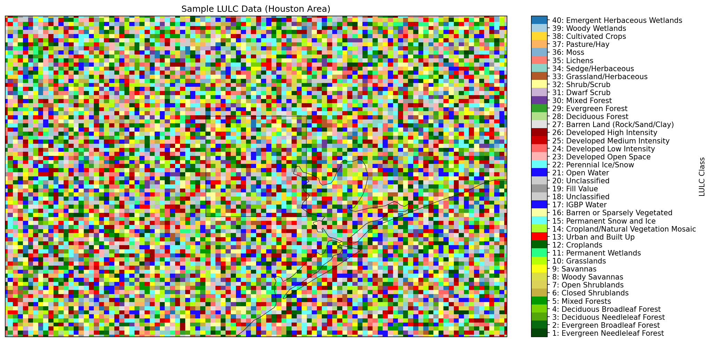

# WRF NLCD LULC Converter

[](https://opensource.org/licenses/Apache-2.0)
[](https://www.python.org/downloads/)
[](https://github.com/ankurk017/wrf_nlcd_lulc_converter)

A Python package for converting National Land Cover Database (NLCD) land use data and updating WRF (Weather Research and Forecasting) geo_em files with new land use information.

## Repository

This package is maintained by [Ankur Kumar](https://github.com/ankurk017) and is available at: https://github.com/ankurk017/wrf_nlcd_lulc_converter

**Contact Information:**
- Email: ankurk017@gmail.com, ankur.kumar@uah.edu, ankur.kumar@nasa.gov

## Sample Output



*Actual LULC data from WRF geo_em file showing real land use classes for the Texas/Gulf Coast region (370,152 pixels, 28 unique classes).*

## Origin

This package was converted from a Jupyter notebook (`NLCD_replace_geo_em.ipynb`) that demonstrated the process of updating WRF geo_em files with NLCD land use data. The notebook functionality has been modularized into a reusable Python package with additional features including:

- Command-line interface for batch processing
- Custom LULC mapping support
- Urban-only processing option
- Comprehensive error handling and validation
- Unit tests for reliability
- Multiple usage examples

## Features

- Crop NLCD GeoTIFF files to specific domains using GDAL
- Interpolate NLCD land use data to WRF grid coordinates
- Map NLCD urban classes to WRF/GEOG urban classes
- Generate LANDUSEF arrays from LU_INDEX data
- Update WRF geo_em NetCDF files with new land use information
- Support for multiple NLCD years and WRF domains
- **Visualization tools** for LULC data and urban comparisons
- **Plotting utilities** with cartopy for geographic plots

## Installation

### Prerequisites

- Python 3.8 or higher
- GDAL (for GeoTIFF processing)
- NetCDF4 libraries

### Install GDAL

**Ubuntu/Debian:**
```bash
sudo apt-get install gdal-bin libgdal-dev
```

**CentOS/RHEL:**
```bash
sudo yum install gdal gdal-devel
```

**macOS:**
```bash
brew install gdal
```

### Install the Package

```bash
# Clone the repository
git clone https://github.com/ankurk017/wrf-nlcd-lulc-converter.git
cd wrf-nlcd-lulc-converter

# Install in development mode
pip install -e .

# Or install with development dependencies
pip install -e .[dev]
```

## Usage

### Basic Usage

```python
from wrf_nlcd_lulc_converter import NLCDProcessor

# Initialize processor
processor = NLCDProcessor()

# Process NLCD data and update WRF file (Matrix users can use the default NLCD folder)
processor.process_nlcd_and_update_wrf(
    nlcd_file="/nas/rstor/akumar/common/NLCD_raw_maps/Annual_NLCD_LndCov_2017_CU_C1V1.tif",
    wrf_file="path/to/geo_em.d02.nc",
    output_file="path/to/geo_em_updated.nc",
    year="2017"
)
```

### Command Line Interface

```bash
# Basic usage (Matrix users can use the default NLCD folder)
wrf-nlcd-converter --nlcd-file /nas/rstor/akumar/common/NLCD_raw_maps/Annual_NLCD_LndCov_2017_CU_C1V1.tif --wrf-file path/to/geo_em.d02.nc --output-file path/to/output.nc --year 2017

# With custom domain margins
wrf-nlcd-converter --nlcd-file /nas/rstor/akumar/common/NLCD_raw_maps/Annual_NLCD_LndCov_2017_CU_C1V1.tif --wrf-file path/to/geo_em.d02.nc --output-file path/to/output.nc --year 2017 --margin 2.0
```

### Advanced Usage

```python
from wrf_nlcd_lulc_converter import NLCDProcessor, LULCMapping

# Custom LULC mapping
custom_mapping = {
    21: 23,  # NLCD Open Water -> WRF Developed Open Space
    22: 24,  # NLCD Perennial Ice/Snow -> WRF Developed Low Intensity
    23: 25,  # NLCD Developed Open Space -> WRF Developed Medium Intensity
    24: 26,  # NLCD Developed Low Intensity -> WRF Developed High Intensity
}

processor = NLCDProcessor(lulc_mapping=custom_mapping)

# Process with custom parameters
processor.process_nlcd_and_update_wrf(
    nlcd_file="path/to/nlcd.tif",
    wrf_file="path/to/geo_em.d02.nc",
    output_file="path/to/geo_em_updated.nc",
    year="2017",
    margin=1.5,
    force_recalculate=True
)
```

### Visualization

```python
from wrf_nlcd_lulc_converter import plot_lulc_data, plot_urban_comparison

# Plot LULC data
plot_lulc_data(longitudes, latitudes, lulc_data,
               title="LULC Data",
               extent=[lon_min, lon_max, lat_min, lat_max],
               save_path="lulc_plot.png")

# Compare urban areas before and after
plot_urban_comparison(original_lulc, updated_lulc, 
                     longitudes, latitudes,
                     title="Urban Area Comparison",
                     save_path="urban_comparison.png")
```

## API Reference

### NLCDProcessor

Main class for processing NLCD data and updating WRF files.

#### Methods

- `process_nlcd_and_update_wrf()`: Main processing method
- `crop_nlcd_with_gdalwarp()`: Crop NLCD GeoTIFF to domain
- `interpolate_nlcd_to_wrf_grid()`: Interpolate NLCD data to WRF grid
- `update_wrf_file()`: Update WRF NetCDF file with new data

### LULCMapping

Class containing land use/land cover class definitions and color mappings.

#### Attributes

- `lulc_dict`: Dictionary of LULC class definitions
- `lulc_colors`: List of colors for plotting
- `lulc_labels`: List of class labels
- `cmap_40`: Matplotlib colormap for 40-class LULC data

### Plotting Functions

#### `plot_lulc_data()`
Plot LULC data with geographic context and proper color mapping.

#### `plot_urban_comparison()`
Create side-by-side comparison of urban areas before and after processing.

#### `plot_domain_info()`
Plot WRF domain information with LULC data.

#### `create_sample_plot()`
Generate a sample plot for demonstration purposes.

### Colormap Module

The package includes a comprehensive colormap module (`wrf_nlcd_lulc_converter.colormap`) with functions for:

#### `get_lulc_colormap()`
Get the 40-class LULC colormap with exact colors from the original notebook.

#### `get_lulc_normalization()`
Get normalization bounds, ticks, and labels for LULC plotting.

#### `create_colorbar()`
Create standardized colorbars for LULC plots.

#### `get_class_info()`
Get label and color information for specific LULC classes.

#### `plot_colormap_legend()`
Create comprehensive legends showing all 40 LULC classes.

## Examples

See the `examples/` directory for complete working examples that use the actual WRF file (`/nas/rstor/akumar/common/sample_geog/geo_em.d02.nc`):

- `simple_wrf_example.py`: Simple example using actual WRF data (minimal dependencies)
- `colormap_example.py`: Demonstrates the colormap module with real WRF data
- `plotting_example.py`: Comprehensive plotting examples using actual WRF file
- `complete_workflow_example.py`: Complete workflow with visualization
- `urban_only_example.py`: Example for urban-only processing

## Data Sources

### NLCD Data

Download NLCD data from the [MRLC Viewer](https://www.mrlc.gov/data?f%5B0%5D=category%3ALand%20Cover&f%5B1%5D=project_tax_term_term_parents_tax_term_name%3AAnnual%20NLCD&f%5B2%5D=project_tax_term_term_parents_tax_term_name%3AAnnual%20NLCD)

**Note for Matrix Users**: NLCD raw maps from 1985 to 2024 are available in the default folder:
```
/nas/rstor/akumar/common/NLCD_raw_maps
```

### WRF geo_em Files

Generate WRF geo_em files using WPS (WRF Preprocessing System) with the geogrid utility.

## Contributing

1. Fork the repository
2. Create a feature branch (`git checkout -b feature/amazing-feature`)
3. Commit your changes (`git commit -m 'Add some amazing feature'`)
4. Push to the branch (`git push origin feature/amazing-feature`)
5. Open a Pull Request

## License

This project is licensed under the MIT License - see the [LICENSE](LICENSE) file for details.

## Citation

If you use this package in your research, please cite:

```bibtex
@software{wrf_nlcd_lulc_converter,
  title={WRF NLCD LULC Converter},
  author={Ankur Kumar},
  year={2024},
  url={https://github.com/ankurk017/wrf-nlcd-lulc-converter},
  note={Contact: ankurk017@gmail.com, ankur.kumar@uah.edu, ankur.kumar@nasa.gov}
}
```